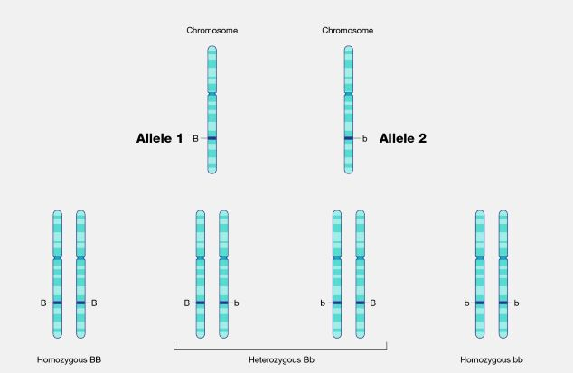
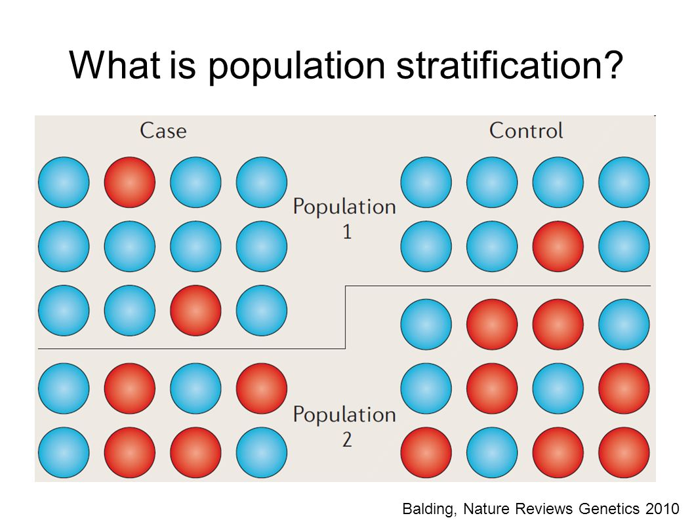
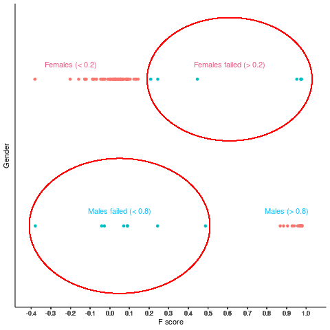
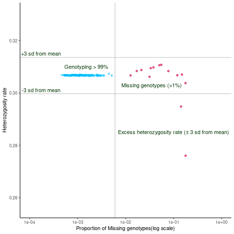
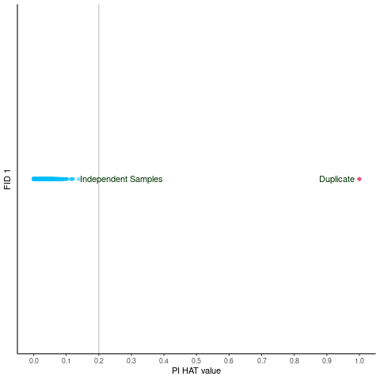

# Introduction

A genome-wide association study (GWAS) is a type of study that uses
genomic data to identify genetic variations that are associated with a
particular trait or disease (Marees et al, 2018). It involves genotyping
a large number of single nucleotide polymorphisms (SNPs) across the
entire genome of many individuals and comparing the frequency of these
SNPs in individuals with the trait or disease of interest compared to
those without the trait or disease. The goal of a GWAS is to identify
specific genetic loci that are associated with the trait or disease,
which can provide insight into the underlying biological mechanisms and
potentially lead to the development of new diagnostic tools and
treatments.

GWAS has been used to identify genetic risk factors for a wide range of
complex diseases and traits, including cardiovascular disease, type 2
diabetes, cancer, and many others. By utilizing large sample sizes and
high-throughput genotyping technologies, GWAS has revolutionized our
understanding of the genetic basis of complex traits and has become a
powerful tool in the field of genetics and genomics.

## Key Words in GWAS

### Allele


<p class="caption">
Allele
</p>

At a specific genomic location, an allele is one of two or more
variations of the DNA sequence (a segment of bases or a single base).
For each genomic region with such variation, an individual inherits two
alleles, one from the mother and another from the father. The person is
homozygous for the allele if the two alleles are identical. The person
is heterozygous if the alleles are distinct from one another.

### Gene

### Haplotype

### Hardy–Weinberg (dis)equilibrium (HWE)

### Heterozygosity

### Homozygosity

### Linkage disequilibrium (LD)

### Minor allele frequency

### Multiple comparison

### Population stratification


<p class="caption">
Population Stratification
</p>

-   Population stratification is a threat to the validity of genetic
    association studies. Population stratification may confound results
    if not adjusted. A population in a genetic association study may
    arise from two distinct sub-populations which may differ in their
    genetic ancestry. Systematic differences in allele frequencies
    between these two subpopulations may confound the result. There are
    thousands of neutral loci, known as **genomic controls**, used to
    correct for population stratification in GWAS.

In GWAS, researchers typically examine the association between genetic
variants and traits or diseases of interest in a study population.
However, if the study population is not genetically homogeneous, then
associations between genetic variants and traits or diseases may be
confounded by population stratification. This is because the genetic
variants associated with a particular trait or disease may differ in
frequency between different sub populations.

To avoid population stratification in GWAS, researchers can use several
methods, such as principal component analysis (PCA) or multidimensional
scaling (MDS), to identify and correct population stratification. These
methods involve examining the genetic variation within the study
population and identifying groups of genetically similar individuals,
often based on patterns of genetic variation across the genome. By
accounting for population stratification in this way, researchers can
more accurately identify genetic variants associated with the trait or
disease of interest in the study population.

### Relatedness

### Single Nucleotide Polymorhisms

# Material and Methods

**Tools, Software and Files Required**

-   **plink**
    -   [link1](https://www.cog-genomics.org/plink2/)
    -   [link2](https://www.cog-genomics.org/plink/2.0/)
-   **bcftools and samtools**
    -   [link](http://www.htslib.org/download/)
-   **vcftools**
    -   [link](https://sourceforge.net/projects/vcftools/files/)
-   **Check for compatibility with the input required by the Sanger
    server.**
    -   [link](http://qbrc.swmed.edu/zhanxw/software/checkVCF/checkVCF-20140116.tar.gz)
-   **Haplotype Reference Consortium v1.1 panel for HRC site list**
    -   [link](HRC.r1-1.GRCh37.wgs.mac5.sites.tab)[link](ftp://ngs.sanger.ac.uk/production/hrc/HRC.r1-1/)
-   **HRC preparation checking tool**
    -   [link](https://www.well.ox.ac.uk/~wrayner/tools/HRC-1000G-check-bim-v4.2.9.zipa)
-   Set the path for these tools so you directly call them from a
    different folder. To set the path first you have enter in that
    specific tools

**export PATH=*P**A**T**H*:(pwd)**

## Basic input files

We expect two basic input files, Raw.ped and Raw.map, for association
analysis. Here, raw is the file name. PED (Plink Pedigree File) and MAP
(Plink Map File) are file formats commonly used in genome-wide
association studies (GWAS). These files can also be converted into
binary format.

### PED File

The PED file is a tab-delimited text file that contains information
about individuals in a study, including their family relationships and
genotype data. Each row in the PED file represents a single individual,
and each column represents a different type of information, such as the
individual’s family ID, individual ID, and genotype data. The first six
columns in a PED file are required and include the following
information:

| FID | IID | PID | MID | Sex | P   | rs1 | rs2 |
|-----|-----|-----|-----|-----|-----|-----|-----|
| 1   | 1   | 0   | 0   | 1   | 1   | CT  | AG  |
| 2   | 2   | 0   | 0   | 0   | 1   | CG  | AA  |
| 3   | 3   | 0   | 0   | 1   | 0   | CC  | TT  |

-   FID = Family ID,a unique identifier for the family to which the
    individual belongs
-   IID = Individual ID, a unique identifier for the individual within
    the family
-   PID = Paternal ID,the individual ID of the father (-9 if unknown)
-   MID = Maternal ID, the individual ID of the mother (-9 if unknown)
-   Sex (1 = male; 2 = female; other = -9)
-   P = Phenotype, the phenotype of the individual, usually coded as a
    binary trait (e.g. affected=1, unaffected=2, missing=0)

The remaining columns in the PED file contain genotype data for each
individual.

-   rs1 = SNP1
-   rs2 = SNP2

Sixth column represents phenotype. The phenotype can be either an
affection status or quantitative trait. Plink can automatically detect
the phenotype based on the code.

### MAP file

Each line of the MAP file explains a single marker and contains four
columns. The MAP file is a tab-delimited text file that contains
information about each SNP (single nucleotide polymorphism) that was
genotyped in the study. Each row in the MAP file represents a single
SNP, and each column represents a different type of information, such as
the chromosome number, SNP identifier, and base-pair position. The
columns in a MAP file include the following information:

| Chr | SNP | GD  | BPP    |
|-----|-----|-----|--------|
| 1   | rs1 | 0   | 870050 |
| 1   | rs2 | 0   | 870150 |
| 1   | rs3 | 0   | 870322 |
| 1   | rs4 | 0   | 870878 |

-   Chr = Chromosome (1-22, X, Y or 0 if unplaced), the chromosome
    number on which the SNP is located
-   rs = a unique identifier for the SNP
-   GD = the distance between this SNP and the previous SNP (in Morgans)
-   BPP = the position of the SNP on the chromosome (in base-pairs)

The autosomes should be coded 1 through 22. The following other codes
can be used to specify other chromosome types: <br>

| Region | Genomic region               | Number |
|--------|------------------------------|--------|
| X      | X chromosome                 | 23     |
| Y      | Y chromosome                 | 24     |
| XY     | Pseudo-autosomal region of X | 25     |
| MT     | Mitochondrial                | 26     |

Together, the PED and MAP files provide all the information needed to
perform a GWAS. The genotype data in the PED file can be combined with
the information about each SNP in the MAP file to test for associations
between genotype and phenotype. This is typically done using a
statistical software package, such as PLINK.

## Binary file format

Binary file formats are an alternative to the text-based PED/MAP file
formats commonly used in GWAS. Binary file formats offer several
advantages over text-based file formats, including faster loading times,
reduced storage space requirements, and improved data compression.
Binary files (fam, bed and bin) are smaller in size and run faster than
basic files (ped and map).

### BED

### BIM

A BIM file is a file format used to store and organize data on genetic
variants that are included in a study. The BIM file contains information
on the chromosome, variant ID, position, and allele information for each
genetic variant.

The BIM file is typically a tab-delimited text file with six columns:
chromosome number, variant ID, genetic position, base-pair position, the
reference allele, and the alternate allele. The chromosome number column
specifies which chromosome the genetic variant is located on, while the
variant ID column provides a unique identifier for the variant. The
genetic position and base-pair position columns provide information on
the location of the variant on the chromosome. The reference allele and
alternate allele columns provide information on the two possible alleles
for the variant.

GWAS typically involve the analysis of large numbers of genetic
variants, and the BIM file helps to ensure that data is organized and
analyzed correctly. The BIM file is used in conjunction with other
files, such as genotype files (e.g., PLINK binary files), to identify
associations between genetic variants and traits or diseases of
interest.

| Chr | SNP | GD  | BPP    | Allele1 | Allele2 |
|-----|-----|-----|--------|---------|---------|
| 1   | rs1 | 0   | 870050 | C       | T       |
| 1   | rs2 | 0   | 870150 | A       | G       |
| 1   | rs3 | 0   | 870322 | G       | G       |
| 1   | rs4 | 0   | 870878 | C       | A       |

### FAM

In a GWAS, a FAM file is a text file that contains information about the
individuals being studied. The FAM file is used to specify the familial
relationships and phenotype information for each individual in the
study.

The FAM file typically contains three columns of data separated by
whitespace or tab characters. The first column contains a family ID,
which is a unique identifier for a particular family or group of related
individuals. The second column contains an individual ID, which is a
unique identifier for each individual within a family. The third column
contains the phenotype information for each individual, such as disease
status or a quantitative trait.

For example, a FAM file might look like this:

| familyID | individualID | fatherID | motherID | sex | phenotype |
|----------|--------------|----------|----------|-----|-----------|
| 1        | 1            | 0        | 0        | 1   | 1         |
| 1        | 2            | 0        | 0        | 2   | 0         |
| 1        | 3            | 1        | 2        | 1   | 1         |
| 1        | 4            | 1        | 2        | 2   | 0         |

In this example, there is one family with four individuals. The first
column specifies the family ID, which is 1 in this case. The second
column specifies the individual ID, ranging from 1 to 4. The third and
fourth columns specify the IDs of the father and mother for each
individual, respectively. The fifth column specifies the sex of each
individual (1 for male and 2 for female). The sixth column specifies the
phenotype, with 1 indicating affected by the disease or trait of
interest, and 0 indicating unaffected.The phenotype can be either a
quantitative trait or an affection status column: PLINK will
automatically detect which type. \# Methods

## Steps to perform Genome-wide association study:

1.  If we get ped and map file, first should convert it into binary
    format (bed, bim and fam) <br> <br> **./plink –file raw_GWAS_data
    –make-bed** <br> <br> Note: Earlier version of plink reads X
    chromosome as 23, Y chromosome as 24, pseudo-autosomal region of X
    as 25 and mitochondrial as 26. However, plink2 reads them with X, Y
    etc. <br> <br>

**Quality controls steps:** <br> GWASs use thousands of markers to test
association. Even a low rate of error or bias will introduce false
positive associations. It has been suggested that removal of handful
individuals or small percentage of markers should not markedly decrease
the overall power of the study. Removal of one marker has greater impact
than removal of one individual. Removal of one marker is potentially an
overlooked disease association. Thus, implementing QC per-individual
before QC per-marker will maximize the number of markers remaining in
the study.

### Per Individual Quality Control

Per-individual QC screens genotype to identify subjects that may
introduce bias, if not removed. There are several steps of
per-individual QC for a GWAS data set.

#### Identification of individuals with discordant sex information

<br> PLINK command <br> **plink –bfile raw_GWAS_data –check-sex –out
GWAS_Sex_Check** <br>

-   Command Create a list of individuals with discordant sex data in
    file “GWAS_Sex_Check.sexcheck”. Column 3 denotes ascertained sex and
    column 4 denotes sex according to genotype data. When the
    homozygosity rate is more than 0.2 but less than 0.8, the genotype
    data are inconclusive regarding the sex of an individual and these
    are marked in column 4 with a 0.
-   Extract the IDs of individuals with discordant sex information. In
    situations in which discrepancy cannot be resolved, remove the
    individuals through following command. <br> <br> PLINK command <br>
    **plink –bfile raw_GWAS_data –remove
    discordant-sex-individuals-file.txt –make-bed –out
    1_QC_Raw_GWAS_data** <br> <br> (File
    “discordant-sex-individuals-file.txt”, should contain only FID and
    IID of the individuals that have to be removed)

``` r
Gender <- read.table("Sex_check_1.sexcheck", header = T, as.is = T) %>%
  na.omit()
png("Gender_check.png")
ggplot(Gender, aes(x=F, y= PEDSEX, col = STATUS))+
  geom_point()+
  labs(y="Gender", x = "F score")+
  theme_classic()+
  scale_x_continuous(breaks = round(seq(min(Gender$F), 1, by = 0.01), 1))+
  theme(strip.text.x = element_blank())+
  geom_circle(aes(x0 = 0.61,  y0 = 2, r = 0.42),
              inherit.aes = FALSE,
              col = "Red")+
  geom_circle(aes(x0 = 0.05,  y0 = 1, r = 0.46),
              inherit.aes = FALSE,
              col = "Red")+
  theme(axis.text.y = element_blank(),
        axis.ticks.y = element_blank(),
        legend.position = "none")+
  annotate(geom="text", x=-0.2, y=2.1, label="Females (< 0.2)",
           color="#e75480")+
  annotate(geom="text", x=0.9, y=1.1, label="Males (> 0.8)",
           color="#00bfff")+
  annotate(geom="text", x=0.61, y=2.1, label="Females failed (> 0.2)",
           color="#e75480")+
  annotate(geom="text", x=0.05, y=1.1, label="Males failed (< 0.8)",
           color="#00bfff")
dev.off()
```


<p class="caption">
Discordant Sex information
</p>

#### Identification of individuals with elevated missing data rates

<br> PLINK command <br> **./plink2 –bfile 1_QC_Raw_GWAS_data –missing
–out missing_data_rate** <br> - Command creates the files
“missing_data_rate.imiss” and “missing_data_rate.lmiss”. - The fourth
column in the .imiss file (N_MISS) denotes the number of missing SNPs
and the sixth column (F_MISS) denotes the proportion of missing SNPs per
individual.

#### Identification of individuals with outlying heterozygosity rate

<br> PLINK command <br> **./plink –bfile 1_QC_Raw_GWAS_data –het –out
outlying_heterozygosity_rate** <br> <br> **NOTE: plink2 format will give
results in a different way** <br> - Command creates the file
“outlying_heterozygosity_rate.het”, in which the third column denotes
the observed number of homozygous genotypes \[O(Hom)\] and the fifth
column denotes the number of non-missing genotypes \[N(NM)\] per
individual.

``` r
# Missing individual & Heterozygosity rate
miss <- fread("SEX_data/Missing_sample/missing_data_rate.imiss")
hetro <- fread("SEX_data/Missing_sample/Heterozygosity_rate/outlying_heterozygosity_rate.het")
head(miss, 2)
head(hetro, 2)

# Calculate the observed heterozyosity rate
hetro$obs_hetero_rate <- ((hetro$`N(NM)`)-hetro$`E(HOM)`)/hetro$`N(NM)`
```

-   Merge the “missing_data_rate.smiss” and
    “outlying_heterozygosity_rate.het” hetroandmiss\<- merge(hetro,
    miss, by=“IID”)

``` r
# Merge missing file and heterozygoisty file
hetro_miss <- miss %>% 
  left_join(hetro, by = "IID")
```

``` r
# Creating plot
png("Missing_hetero_check.png")
ggplot(hetro_miss, aes(x = F_MISS, y = obs_hetero_rate))+
  geom_point(alpha = 0.5, col = "#00bfff")+
  labs(x ="Proportion of Missing genotypes(log scale)", y = "Heterozygosity rate")+
  scale_x_log10(limits = c(0.0001, 1))+
  theme_classic()+
  scale_y_continuous(limits = c((min(hetro_miss$obs_hetero_rate) - 0.02), (max(hetro_miss$obs_hetero_rate) + 0.02)))+
  geom_hline(yintercept = mean(hetro_miss$obs_hetero_rate) + 3*sd(hetro_miss$obs_hetero_rate), col = "Grey")+
  geom_hline(yintercept = mean(hetro_miss$obs_hetero_rate) - 3*sd(hetro_miss$obs_hetero_rate), col = "Grey")+
  geom_vline(xintercept = 0.006, col = "Grey")+
  geom_point(data=hetro_miss %>%
               filter(F_MISS > 0.01),
             pch = 19,
             size=1.6,
             colour = "#e75480")+
  annotate(geom="text", x=0.035, y=0.303, label="Missing genotypes (>1%)",
           color="#003300")+
  annotate(geom="text", x=0.1, y=0.285, label="Excess heterozygosity rate (± 3 sd from mean)",
           color="#003300")+
  annotate(geom="text", x=0.00017, y=0.315, label="+3 sd from mean",
           color="#003300")+
  annotate(geom="text", x=0.00017, y=0.301, label="-3 sd from mean",
           color="#003300")+
  annotate(geom="text", x=0.0015, y=0.31, label="Genotyping > 99%",
           color="#003300")

dev.off()
```


<p class="caption">
Individual missingness and heterozygoisty rate
</p>

#### Identification of duplicated or related individuals

-   Check the relatedness. Use the independent SNPs (pruning) for this
    analysis and limit to autosomal chromosome only <br> PLINK command
    <br> **plink –bfile 2_QC_Raw_GWAS_data –chr 1-22 –make-bed –out
    Autosomal**
-   Create independent SNPs through pruning <br> PLINK command <br>
    **plink –bfile Autosomal –indep-pairwise 50 5 0.2 –out
    raw-GWAS-data** <br> it will generate raw-GWAS-data.prune.in file.
    This file use in next step
-   Check relatedness <br> PLINK command <br> **plink –bfile
    2_QC_Raw_GWAS_data –extract raw-GWAS-data.prune.in –genome –out
    related_check** <br>

| PIHAT values  | Relation               |
|---------------|------------------------|
| 1             | Identical or Duplicate |
| 0.8 and above | Highly related         |
| 0.5           | First Degree           |
| 0.25          | Highly related         |
| 0.125         | First Cousin           |
| 0.0625        | Second Cousin          |


<p class="caption">
Relatedness
</p>

#### Identification of Individuals of divergent ancestry

1.  **Multidimensional scaling** <br> PLINK Command <br> **plink –bfile
    3_QC_Raw_GWAS_data –extract raw-GWAS-data.prune.in –genome –cluster
    –mds-plot 10**

-   Visualizing population structure using MDS is useful for identifying
    subpopulations, population stratification and systematic genotyping
    or sequencing errors, and can also be used to detect individual
    outliers that may need to be removed, e.g. European-Americans
    included in a study of African-Americans.

1.  **Principal component analysis** <br> PLINK Command <br> **plink
    –bfile 3_QC_Raw_GWAS_data –genome –cluster –pca 10**

-   We can also utilize hapmap data to perform PCA

### Per SNP quality control

#### Hardy Weinberg equilibrium

-   If the frequency of observed genotypes of a variant in a population
    can be derived from the observed allele frequencies, the genetic
    variant is said to be in Hardy–Weinberg equilibrium.
-   Genotype frequencies remain stable from one generation to another in
    the absence of any evolutionary pressure (selection, mutation and
    migration).
-   The goodness-of-fit test is used to test HWE is not a powerful test
    and reliability of results depends on the sample size.

| Sample size | 50   | 100  | 200  | 300      | 400       |
|-------------|------|------|------|----------|-----------|
| AA count    | 21   | 42   | 84   | 126      | 168       |
| AB count    | 25   | 50   | 100  | 150      | 200       |
| BB count    | 4    | 8    | 16   | 24       | 32        |
| HWE p value | 0.52 | 0.26 | 0.08 | **0.02** | **0.009** |

Source: Genetic Epidemiology: Mehmet T Dorak <br> - Rule of thumb: the
heterozygote frequency can only reach a maximum of 50%. If heterozygote
frequencies are more than 50%, it is a clear sign of HWD, regardless of
statistical test result. - Most common reason is not biological,
**genotyping error** is most plausible exploration.

<br> PLINK Command <br> **./plink2 –bfile 4_QC_Raw_GWAS_data –geno 0.01
–hwe 0.00000001 –make-bed –out 5_QC_Raw_GWAS_data**

# References

1- Marees, A.T., et al, 2018. A tutorial on conducting genome‐wide
association studies: Quality control and statistical analysis. *Int J
Methods Psychiatr Res*, Jun; 27(2): e1608.
