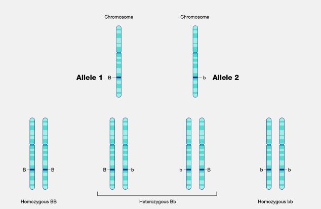

-   <a href="#key-words-in-gwas" id="toc-key-words-in-gwas">Key Words in
    GWAS</a>
    -   <a href="#allele" id="toc-allele">Allele</a>
    -   <a href="#gene" id="toc-gene">Gene</a>
    -   <a href="#genotype" id="toc-genotype">Genotype</a>
    -   <a href="#haplotype" id="toc-haplotype">Haplotype</a>
    -   <a href="#hardyweinberg-disequilibrium-hwe"
        id="toc-hardyweinberg-disequilibrium-hwe">Hardy–Weinberg
        (dis)equilibrium (HWE)</a>
    -   <a href="#heterozygosity" id="toc-heterozygosity">Heterozygosity</a>
    -   <a href="#homozygosity" id="toc-homozygosity">Homozygosity</a>
    -   <a href="#linkage-disequilibrium-ld"
        id="toc-linkage-disequilibrium-ld">Linkage disequilibrium (LD)</a>
    -   <a href="#minor-allele-frequency" id="toc-minor-allele-frequency">Minor
        allele frequency</a>
    -   <a href="#multiple-comparison" id="toc-multiple-comparison">Multiple
        comparison</a>
    -   <a href="#population-stratification"
        id="toc-population-stratification">Population stratification</a>
    -   <a href="#relatedness" id="toc-relatedness">Relatedness</a>
    -   <a href="#single-nucleotide-polymorhisms"
        id="toc-single-nucleotide-polymorhisms">Single Nucleotide
        Polymorhisms</a>

# Key Words in GWAS

### Allele

An allele is one of two or more DNA sequence variations (a segment of
bases or a single base) at a specific genomic location. For each genomic
region with such variation, an individual inherits two alleles, one from
the mother and another from the father. The person is homozygous (BB or
bb) for the allele if the two alleles are identical. The person is
heterozygous (Bb) if the alleles are distinct. Here, allele B or b
represents A, G, C, or T (REF:
[link](https://www.genome.gov/genetics-glossary)).

### Gene

A gene is a sequence of DNA that contains the instructions for producing
a particular protein or RNA molecule, which performs a specific function
in a cell. Genes are the basic units of heredity and are passed down
from one generation to the next. Genes are located on chromosomes, which
are long strands of DNA that are found in the nucleus of a cell. The
human genome contains about 20,000 genes, which code for a wide variety
of proteins and RNA molecules involved in processes such as metabolism,
growth and development, and immune system function.

The DNA sequence of a gene determines the specific instructions for
producing a protein or RNA molecule. This sequence is made up of four
types of nucleotides: adenine (A), thymine (T), cytosine (C), and
guanine (G). The sequence of nucleotides in a gene determines the
sequence of amino acids in the protein that is produced, which in turn
determines the protein’s shape and function.

Genes can be affected by mutations, which are changes in the DNA
sequence. Some mutations can result in altered or nonfunctional
proteins, leading to diseases or other genetic disorders. Other
mutations may have no effect or even result in beneficial changes that
can be passed down to future generations through natural selection.

### Genotype

### Haplotype

### Hardy–Weinberg (dis)equilibrium (HWE)

### Heterozygosity

### Homozygosity

### Linkage disequilibrium (LD)

### Minor allele frequency

### Multiple comparison

### Population stratification

-   Population stratification is a threat to the validity of genetic
    association studies. Population stratification may confound results
    if not adjusted. A population in a genetic association study may
    arise from two distinct sub-populations which may differ in their
    genetic ancestry. Systematic differences in allele frequencies
    between these two subpopulations may confound the result. There are
    thousands of neutral loci, known as **genomic controls**, used to
    correct for population stratification in GWAS.

In GWAS, researchers typically examine the association between genetic
variants and traits or diseases of interest in a study population.
However, if the study population is not genetically homogeneous, then
associations between genetic variants and traits or diseases may be
confounded by population stratification. This is because the genetic
variants associated with a particular trait or disease may differ in
frequency between different sub populations.

To avoid population stratification in GWAS, researchers can use several
methods, such as principal component analysis (PCA) or multidimensional
scaling (MDS), to identify and correct population stratification. These
methods involve examining the genetic variation within the study
population and identifying groups of genetically similar individuals,
often based on patterns of genetic variation across the genome. By
accounting for population stratification in this way, researchers can
more accurately identify genetic variants associated with the trait or
disease of interest in the study population.

#### Principal component analysis

Principal component analysis (PCA) is a statistical method used in
genome-wide association studies (GWAS) to identify population structure
and correct for potential confounding effects.

PCA is a multivariate statistical technique that identifies linear
combinations of the original variables that capture the largest amount
of variation in the data. In the context of GWAS, PCA is typically
applied to the genotype data to identify patterns of genetic variation
that are associated with ancestry or population structure.

### Relatedness

### Single Nucleotide Polymorhisms
